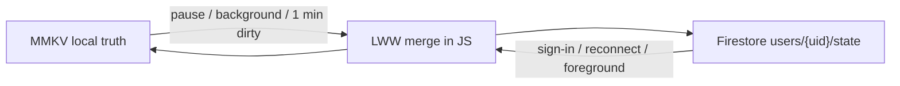

# Cloud sync (Phase 6)

Local-first backup for one Google account. Playback never waits on the network. JS is still a no-op in [`src/sync/index.ts`](../src/sync/index.ts); this is the contract when that OTA lands.

Screens talk to `src/sync/` only. They must not import Firebase or Google Sign-in.

---

## What it is

MMKV on the device is the truth. Cloud is a JSON document keyed by the signed-in Google `uid`. Two phones share that document. It is not a live multiplayer database: no Firestore listeners, no anonymous auth, no sign-in in the wizard.

**UI:** Settings → Cloud sync only. Sign in with Google. Optional “Sync now”. Sign-out keeps local data and stops cloud I/O (do not wipe the device).

**Store:** Firebase Auth + Firestore (`users/{uid}/state`). Native modules are already in the APK. Rules: `request.auth.uid == uid`. No Crashlytics, no Analytics.

D1 / Supabase can do the same merge; they are **not** the locked store.

---

## What goes up

Small JSON (low tens of KB). **Not** mp3s, catalogue, or download progress.

| Slice | Shape today | Cloud |
|---|---|---|
| Preferences | locale, simple mode, theme, keep-screen-on, wifi-only, remote primary | Yes. After a first pull on a new install, skip the wizard / intro so they do not run again. |
| Library | `albumId` → `{ updatedAt }` | Yes. Remove needs a **tombstone** (today `removeAlbum` deletes the key — that would resurrect from the other phone). |
| Resume | per-album `{ trackId, positionSec, updatedAt, durationSec? }` + per-album rate | Yes. Rate can share the album’s `updatedAt` or its own. |
| Bookmarks | `{ id, albumId, trackId, positionSec, note?, updatedAt }` | Yes. Remove needs a tombstone (`deletedAt` / `removed`). |
| History | last 50 `{ albumId, trackId, playedAt }` | Yes, but **not** LWW on one field. Union by `(albumId, trackId, playedAt)`, newest first, cap 50. Give each row a stable `id` when sync ships. |
| Wanted-offline | not a store field yet | **Intent only:** set of `trackId`s the user asked to keep. Clear on user remove (tombstone). After reinstall, offer to re-enqueue those ids. Disk `DownloadFile` rows stay device-local. |

Do not sync: in-flight download jobs, snackbars, sleep-timer remaining, `hasCompleted` download indexes.

---

## When cloud runs

Signed-in only. Signed-out: zero cloud I/O.

Local resume still ticks in MMKV. Cloud does **not** write every tick.

**Push** (local dirty → cloud):

- User pause
- App background / screen off
- ~1 min debounce after local edits (bookmark, library, prefs, resume). Same cap as [architecture.mdc](../.cursor/rules/architecture.mdc). If nothing is dirty, the debounce does not fire.

**Pull** (cloud → merge into MMKV) is event-driven. No interval poll.

| Event | Why |
|---|---|
| Sign-in | Merge once; this device is then the baseline. |
| Offline → online | Other phone may have written during a walk. Reuse NetInfo (3s offline debounce, online immediately). |
| App foreground | See 30s skip below. |
| Settings “Sync now” | Explicit; not required for correctness. |

**Foreground 30s skip (not a 30s poll).** `AppState` `active` fires for recents, a call overlay, the shade, Activity recreate. Remember `lastPullAt`. If `now - lastPullAt < 30s`, skip. Ten minutes in the background then open → pull. Home → app → Home in 5s → pull once.

---

## Write cycle (pull-before-push)

The debounce, pause, and background flush are **one** write cycle, not a GET per MMKV key:

1. Already have the cloud doc and its `updated_at` matches `lastPulledUpdatedAt` → **PUT only**.
2. Else **GET → merge → PUT**.
3. PUT version conflict (other phone won) → GET → merge → PUT once more.

Bookmark tap → wait up to ~1 min (or sooner on pause) → one read-merge-write. Playing 20 minutes with no pause → at most ~20 cycles while dirty, usually PUT, GET only when `updated_at` changed or we have never pulled.

---

## Merge

**Last-write-wins on `updatedAt` per entity** (one bookmark, one album’s resume, one library row, one wanted-offline id). Playback is not a special conflict: position is a resume field. Two phones: the later pause for that album wins.

**While this device is playing or buffering:** still merge bookmarks / library / prefs / other albums. **Do not apply remote resume for the album that is playing** until pause. Otherwise phone B would seek phone A mid-paath.

**Deletes:** tombstones. A missing key in a full-document PUT would otherwise bring the other phone’s copy back.

**History:** union then cap 50, not LWW.

---

## Reinstall and two devices

1. Sign in → pull → merge into empty MMKV.
2. Wanted-offline: prompt to re-download those track ids (wifi-only still applies).
3. Resume / bookmarks / library appear without waiting on those downloads.

Sign-out: keep MMKV, stop talking to Firestore.

---

## Cost (why this shape)

No listeners. GET/PUT on sign-in, reconnect, foreground (30s skip), pause, background, and at most ~1 write per minute while dirty.

Firebase Spark (50k reads / 20k writes per day) is enough for testers and a small community. The 1-min dirty flush is the write driver; pause/background-only resume later if Spark’s write cap ever bites. Blaze is still cents at this payload.

Cloudflare D1 is cheaper at large DAU; we locked **Firebase** to match the native stubs already in the binary.

---

## Out of scope

Realtime, anonymous users, gating play on an account, syncing audio files, Cloud Functions, multi-account switching on one device (one Google user per install is enough for V1).
