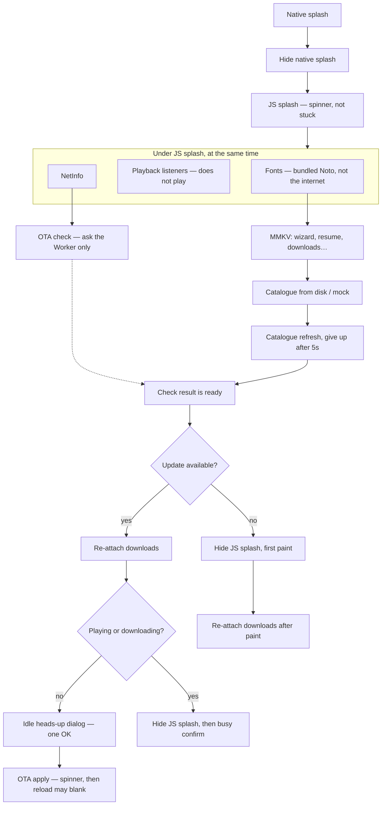

# OTA updates

JS + assets only. Native modules, icons, splash, and `runtimeVersion` stay in the APK/AAB until you ship a new binary.

Host: Cloudflare Worker `https://updatesgurbaniaudioplayer.opensikhapps.com` (check protocol only) + R2 custom domain `https://gurbaniaudioplayer-updates.opensikhapps.com` (Hermes bundle, images, fonts — CDN cache). Native `checkAutomatically` is `NEVER`.

**Check** (`Updates.checkForUpdateAsync`) only asks the Worker if a bundle exists. **Apply** downloads every file from the R2 CDN URLs in the manifest. Cache HITs skip R2 Class B.

The launch bundle is stored as `{prefix}/launch/{sha256}.bin`, not `_expo/static/js/.../index.hbc`. Cloudflare treated that JS-looking path as JavaScript, cached a truncated body, and `fetchUpdateAsync` failed SHA-256. Purge often missed the phone’s PoP. A new content hash is a new cache key; `.bin` is on Cloudflare’s default cacheable list (same class as `.mp3`). `fileExtension` in the manifest stays `.hbc` so expo-updates still writes bytecode.

Cold start: hide native splash immediately and show the JS spinner. Check starts as soon as NetInfo says online. Apply waits until MMKV and downloads are initialized. Idle apply shows a one-button heads-up first. Settings → Check for update skips that heads-up.

---


## Publish

From a tree you want testers/users to run:

```bash
npm run ota:publish
```

That exports the JS bundle and `wrangler r2 object put --remote` into:

`{channel}/{platform}/{runtimeVersion}/`

Default channel is `preview` (`OTA_CHANNEL`). Runtime comes from `app.json` `runtimeVersion` (`OTA_RUNTIME_VERSION` overrides). That string is baked into the APK/AAB — bump it only when you ship a new binary, otherwise testers keep asking the old folder and never see the new publish.

Wrangler **must** use `--remote`. Without it, objects land in local Miniflare and the live Worker never sees them.

Apply URLs in the new manifest all use `https://gurbaniaudioplayer-updates.opensikhapps.com/...` (`OTA_FILES_URL`). Publish GETs the launch `.bin` twice after upload and refuses to swap `manifest.json` if either hash mismatches (second GET is the HIT that used to poison phones).

Before export, publish hashes the native surface (`@expo/fingerprint`) and compares it to `{prefix}/fingerprint.json` on R2 (wrangler `--remote`, not the CDN). `.fingerprintignore` skips `node_modules/`, `android/`, and `ios/`. Version bumps still show up in autolinking JSON; native edits belong in `patches/` or `app.json` plugins. First publish after this exists just stores a baseline. Later, a native mismatch **stops** the publish (JS in `src/` does not). Override only after a new APK/AAB is already out: `OTA_ALLOW_NATIVE_CHANGE=1 npm run ota:publish`. Check without publishing: `npm run ota:fingerprint-check`. Changing `.fingerprintignore` itself changes the hash — re-baseline once with `OTA_ALLOW_NATIVE_CHANGE=1` (that also publishes JS). Phones never download `fingerprint.json`; the protocol `manifest.json` is unchanged.

Confirm: each put should **not** say `Resource location: local`. Then on the preview APK: Settings → Check for update, or force-quit and cold start.

### R2 CDN (one-time)

Same pattern as audio (`gurbaniaudioplayerfiles.opensikhapps.com`):

1. Cloudflare dashboard → R2 → `gurbaniaudioplayer-updates` → Settings → Custom Domains → Add `gurbaniaudioplayer-updates.opensikhapps.com`. Wait until Access is **Allowed** / status **Active**.
2. Rules → **Configuration Rules** (hostname `gurbaniaudioplayer-updates.opensikhapps.com`): **Auto Minify** off (JS/CSS/HTML), **Rocket Loader** off, **Email Obfuscation** off, **Polish** off. Those rewrite bytes; Hermes bytecode is not JS.
3. Caching → Cache Rules, **bypass first**:
  - Match `http.host eq "gurbaniaudioplayer-updates.opensikhapps.com" and ends_with(http.request.uri.path, ".hbc")` → **Bypass cache** (leftover `_expo/static/js/.../index.hbc` objects).
  - Match `http.host eq "gurbaniaudioplayer-updates.opensikhapps.com" and not ends_with(http.request.uri.path, "/manifest.json")` → **Eligible for cache**, Edge TTL **Respect origin**. `.bin` / images / fonts stay cached.
4. `npm run ota:publish`. If verify fails on the second GET, purge **that one URL** (Caching → Configuration → Purge Cache → Custom purge) and publish again.

Do **not** enable the `r2.dev` public development URL. Do **not** serve the launch bundle through the Worker just to avoid cache — that spends a Worker + R2 op on every apply.

---


## Channels (preview vs Play)

The channel is **baked into the binary** (`expo-channel-name`). `app.json` defaults to `preview`. `app.config.ts` overrides to `production` only when `EAS_BUILD_PROFILE=production` (the Play AAB). `expo run` / Metro stay on `preview`. Do not set eas.json `channel` — that field is Expo-hosted EAS Update, not this Worker.


| Binary       | Profile      | Channel folder              | Publish                                      |
| ------------ | ------------ | --------------------------- | -------------------------------------------- |
| Sideload APK | `preview`    | `preview/android/1.0.0/`    | `npm run ota:publish`                        |
| Play AAB     | `production` | `production/android/1.0.0/` | `OTA_CHANNEL=production npm run ota:publish` |


Build the AAB from the same tree you publish. `versionCode` is manual (`app.json` `android.versionCode`); bump it before the next Play upload. `autoIncrement` is off.

Do **not** put `EXPO_PUBLIC_USE_MOCK_CATALOGUE=1` on a preview/production build — `app.config.ts` throws. Pages URLs come from `eas.json` env, not `.env`.

## Play AAB (local, no EAS cloud compile)

Signing stays on this machine. `credentialsSource` is `local` (not Expo’s credential server).

1. Generate an upload keystore once (passwords you will remember; file never committed):

```bash
mkdir -p credentials
keytool -genkeypair -v -storetype JKS -keyalg RSA -keysize 2048 -validity 10000 \
  -alias upload \
  -keystore credentials/android-upload.jks \
  -dname "CN=com.opensikhapps.gurbaniaudioplayer,OU=,O=Open Sikh Apps,L=,S=,C=US"
cp credentials.json.example credentials.json
```

Edit `credentials.json` with the keystore and key passwords. `.gitignore` already excludes `credentials.json` and `credentials/`.

2. After designer icons: `npm run build:android:production` (`eas build --local`). Gradle runs here; Expo login is only so EAS CLI knows the project.
3. Upload the `.aab` in Play Console → Production. First upload: accept **App signing by Google Play** (Continue). Your JKS is the **upload** key; Google holds the app-signing key. If you lose the JKS, Play support can reset the upload cert; they cannot if you had opted out of Play App Signing.

Do **not** `ota:publish` to `production` from the same tree as that AAB. Each publish mints a new update id, so store users would download and reload JS they already have embedded. Publish production OTA only when there is a JS change you want on phones that already installed the AAB. The first such publish also stores the Android fingerprint baseline for that folder.

Later iOS: keep `runtimeVersion` `1.0.0`. Android phones only read `production/android/1.0.0/` — they do not see `production/ios/…`. Ship iOS JS with `OTA_CHANNEL=production OTA_PLATFORMS=ios`. Do not bump `runtimeVersion` in `app.json` for iOS-only native; that would make later default publishes miss existing Android binaries. `expo.version` can stay `1.0.0`; iOS `buildNumber` is separate from Android `versionCode`.

`eas submit` is not wired — upload the AAB in the Console. Preview APKs keep using `npm run build:android:preview` and the `preview` channel.

---


## Revert

There is no undo in the Worker. It serves the current `manifest.json` for that channel + platform + runtime.

To roll back: check out the last good JS, publish again to the **same** channel. Devices that already applied the bad bundle pick up the good one on the next check (cold start or Settings). `checkAutomatically` is `NEVER`, so they will not roll back while the app sits in Recents.

Deleting the R2 manifest only stops **new** downloads. Phones that already have the bad JS keep it until you publish a good bundle.

---


## Local APK / AAB vs OTA


| What you do                                                  | What users on that binary get                                                                                                                                                                                                                                                                                                                                                                                                                              |
| ------------------------------------------------------------ | ---------------------------------------------------------------------------------------------------------------------------------------------------------------------------------------------------------------------------------------------------------------------------------------------------------------------------------------------------------------------------------------------------------------------------------------------------------- |
| `eas build --local` (preview APK or a later production AAB)  | Embeds **today’s** JS. OTA later **replaces** that JS if `runtimeVersion` still matches.                                                                                                                                                                                                                                                                                                                                                                   |
| `npm run ota:publish` after that build                       | Next check downloads the new JS. Same `runtimeVersion` required.                                                                                                                                                                                                                                                                                                                                                                                           |
| Bump `runtimeVersion` (native change)                        | Old OTAs are ignored. Publish a new OTA **after** that binary, or users stay on the embedded JS.                                                                                                                                                                                                                                                                                                                                                           |
| Build an APK/AAB from a **newer** checkout than the last OTA | Users who install that binary already have the newer JS. A later `ota:publish` from an **older** checkout would **downgrade** them. Always publish OTA from the same (or newer) tree you meant for that channel.                                                                                                                                                                                                                                           |
| Same native, different JS (no `runtimeVersion` bump)         | **Yes.** Old APKs and new APKs with the same `runtimeVersion` + channel all pull the **current** Worker manifest. After you `ota:publish`, old-APK users get that JS on the next check. Users who already installed the new APK already have that JS if you built the APK from the same tree; they see “latest” until you publish again. If you ship a new APK and **never** publish OTA, old-APK users stay on the JS that was **embedded in their APK**. |
| Metro (`expo start`)                                         | OTA is disabled (`Updates.isEnabled` false).                                                                                                                                                                                                                                                                                                                                                                                                               |


---


## Cold start order

Native splash is only until JS can paint a spinner (`index.js` `preventAutoHide`, then `hideAsync` on first root layout). Sentry and download-notification background taps also register in `index.js`.




Idle heads-up is cold start only (and a late probe that finishes after Home). Settings → Check for update does not show it. The dialog does not survive `reloadAsync`; it only warns before fetch.

Icons, Firebase, Sentry native, Google Sign-in, and `expo-updates` itself never OTA. Those need a new APK/AAB.

---


## Apply behaviour

- Idle (nothing playing, no in-flight downloads): one OK dialog on the JS splash (“update ready, please wait”), then spinner, fetch, reload. Settings skip that dialog.
- Playing or downloading: one confirm (stops playback/downloads; screen may go blank), then pause, cancel downloads, fetch, reload.
- `Updates.reloadAsync()` tears down JS. Overlay and JS splash cannot cover the native blank after that.

---


## Store listing (after OTA says none)

Play Core / App Store lookup is **not** in this binary. Scraping store pages would claim an update during a staged rollout the user is not in. Do not add a native probe for that.

Settings → Check for update stays **OTA first**. Cold start never offers the store.

When the Worker check succeeds and there is **no** JS update: one dialog. Copy must not say a binary is waiting. They already have the latest in-app update; a newer APK/AAB shows as **Update** in Play / App Store only if that store has actually released it to them (country + staged rollout). They may just see **Open**. Buttons: Open store / Not now. The listing is the eligibility check.

**Failed** (network, Worker) is not **none** — do not send them to the store as if they are current. Skip the offer when `Updates.isEnabled` is false, and until the app is actually listed. Preview sideloads must not open the production listing — they are a different OTA channel.

Opening the store does not need the OTA stop-playback / cancel-downloads path. The confirm is enough so a Check tap does not yank them out mid-paath.


---


## Internal app sharing (JS bugs before Production)

An AAB is not sideloadable (`adb install` wants an APK). Day-to-day device testing stays the preview APK (`npm run build:android:preview`, channel `preview`). To smoke-test the Play AAB on a phone, use Play Console **internal app sharing** (Play-signed splits) or `bundletool` (upload-key signed — uninstall before a later Play install).

Internal sharing of the production AAB is the **same** channel and `runtimeVersion` as store users: `production/android/1.0.0/`. `checkAutomatically` is `NEVER`, so a matching OTA still only applies on cold start or Settings → Check for update.

If that AAB’s **JS** is wrong:

- Do **not** bump `runtimeVersion`. That string stays `1.0.0` until Android **native** changes (icons, splash, native modules). A bump only moves **new** binaries to `production/android/1.0.1/`; phones that already installed `1.0.0` keep asking `1.0.0`.
- Do **not** `OTA_CHANNEL=production npm run ota:publish` to patch testers. That folder is shared with every production-channel `1.0.0` install, including Play if that AAB is already in Production.
- Fix JS, rebuild the AAB, bump `versionCode`, upload sharing (or Production) again. Testers get the new **embedded** JS.

If you already published a **bad** production OTA: republish good JS to the **same** folder (`production/android/1.0.0/`). That is the rollback. Deleting the R2 manifest only stops new downloads; phones that already applied the bad bundle keep it until a good publish.